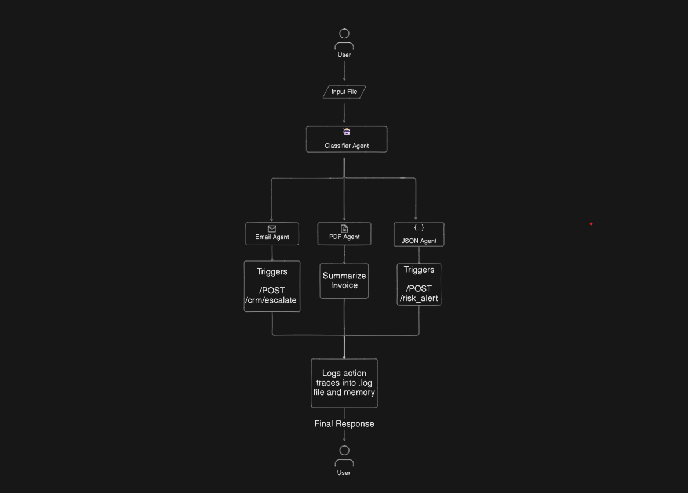

# Multi Agent AI System

This project contains implementation of a multi agent ai system which can classifies emails, json and pdfs. It is able to extract intents, tone and risk associated with the documents mentioned before.


## 🤖 Agents

### 1. Classifier Agent (Level-Up):

    Detects format and business intent

    Classifies: JSON, Email, PDF

    Extracts Intent: RFQ, Complaint, Invoice, Regulation, Fraud Risk

    Passes routing + intent metadata to memory

### 2. Email Agent:

    Extracts structured fields: sender, urgency, issue/request

    Identifies tone (e.g., escalation, polite, threatening)

    Triggers action based on tone + urgency

    Escalate → notify CRM (simulate with API)

    Routine → log and close

### 3. JSON Agent

    Parses webhook data (simulate with provided sample)

    Validates required schema fields

    Flags anomalies (e.g., field mismatch, type errors)

    If anomalies detected → log alert in memory/API

### 4. PDF Agent

    Extracts fields (using PDF parsers, not hardcoded text)

    Parses line-item invoice data or policy document

    Flags if:

    Invoice total > 10,000

    Policy mentions "GDPR", "FDA", etc.

---

### 🚀 Features:

#### 🧠 Shared Memory Store

All agents read from and write to a centralized memory store.

**Stored Data Includes:**
- Input metadata (source, timestamp, classification)
- Extracted fields per agent
- Chained actions that were triggered
- Agent decision traces

---

#### 🔀 Action Router *(New Component)*

Triggers follow-up actions based on agent outputs.

**Examples:**
- Create a support ticket
- Escalate an issue
- Flag a compliance risk

These actions can be simulated via REST calls:

```http
POST /crm
POST /risk_alert
```

### 🔁 End-to-End Flow Example
- User uploads email → Classifier detects: Email + Complaint

- Email agent processes → Tone = angry, Urgency = high

- Action Router calls: POST /crm/escalate

- Memory logs entire trace for audit

---

### 🔁 Workflow Diagram


---

- ### Sample Inputs and Outpus

    - #### Email Agent
        Input:
        

        Output:
        

        Logs:
        

    - #### PDF Agent
        Input:
        

        Output:
        

        Logs:
        

    - #### JSON Agent
        - ##### Valid JSON
        Input:
        

        Output:
        

        Logs:
        

    - #### JSON Agent
        - ##### Invalid JSON
        Input:
        

        Output:
        

        Logs:
        